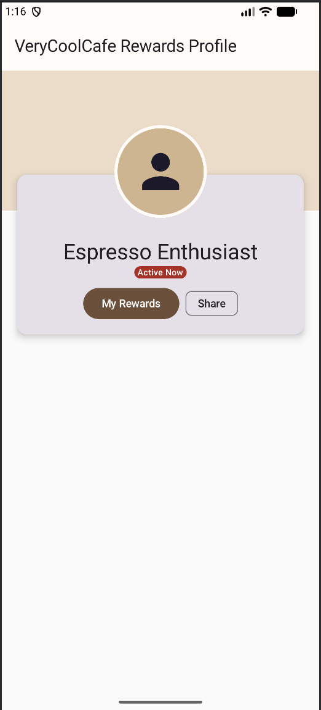

# Cafe Profile Screen (Box Layout Mastery)

### 📝 Project Overview
This project demonstrates the use of the `Box` layout to create a sophisticated, layered UI profile header. The application features a "Cafe Enthusiast" profile using a custom-defined `CafePalette` (Espresso, Cream, and Tan) to create a warm, modern aesthetic. 

It displays a "layered overlap" look where a profile avatar and information card bridge across a background header and a content area.

### 🚀 Key Technical Features
* **Three-Layer Composition**: Utilizes a parent `Box` to manage the Z-axis stacking of the background header, the information card, and the avatar.
* **Coordinate Positioning**: Employs `Alignment.TopCenter` and `Alignment.BottomCenter` combined with pixel-perfect `offset` values to create the overlapping effect required by the rubric.
* **Aspect-Ratio Control**: Uses `aspectRatio` on the primary card to ensure the profile maintains its visual proportions across different device screens.

### 🎨 Material 3 Requirements Met
The following 7 M3 components were implemented (exceeding the requirement of 5):
1.  **TopAppBar**: Acts as the standard navigation anchor.
2.  **Card**: The central container for user information, featuring custom M3 elevation.
3.  **Surface**: Provides the elevated, bordered circular container for the user icon.
4.  **Badge**: Displays the "Active Now" status indicator with M3 styling.
5.  **FilledTonalButton**: A high-emphasis button used for the rewards action.
6.  **AssistChip**: A secondary action chip used for sharing the profile.
7.  **Icon**: Utilizes `Icons.Default.Person` for the primary profile imagery.

### 🛠️ Modifiers Demonstrated
* **`clip(CircleShape)`**: Applied to the avatar Surface to create the required circular profile look.
* **`offset(y = ...)`**: Used with negative values on the Card and positive values on the Avatar to create the "overlap" effect between layers.
* **`zIndex(1f)`**: Explicitly applied to the Avatar to ensure it sits atop both the background header and the overlay card.
* **`CardDefaults.cardElevation`**: Implements the shadow/elevation requirement for visual depth.
* **`aspectRatio(1.8f)`**: Ensures the profile card maintains professional dimensions regardless of screen width.

---

### 📱 Execution Environment
* **Device**: Pixel 8 Pro Emulator
* **SDK Version**: Android 36 (targetSdk)
* **Min SDK**: 26
* **Compose BOM**: 2024.09.00

### 📸 Screenshot

---

# AI DISCLOSURE

### Universal AI Statment 
I utilized Gemini to ensure that I met each of the project requirements, as well as prompting it for assistance with commenting and ensuring my code followed standard Kotlin conventions. In several instances, AI-generated comments were omitted or manually rewritten to ensure accuracy and flow. Because the AI occasionally "hallucinated" requirements or skipped constraints, I manually verified every line of code against the rubric, using Gemini primarily as a second pair of eyes and a brainstorming partner.

Additionally, I used it to draft my READMES, though I occassionally needed to omit unneccessary (and frankly, sometimes strange) details.

---

## Q2: Box Profile Screen
* **Visual Polish:** I consulted Gemini on how to add more detail to the "avatar zone" of the profile header. It suggested using `Icons.Default.Person`, which provided the whimsy and polish necessary to the layout.

